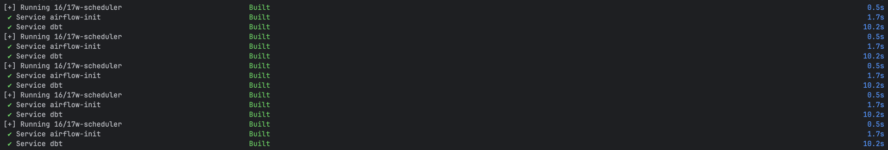
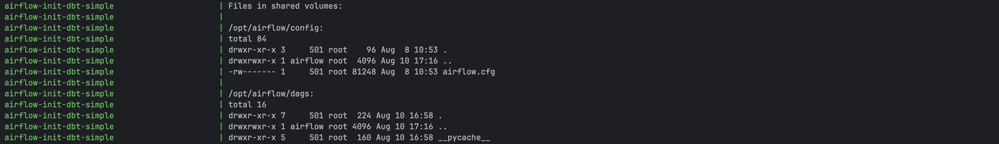

# Airflow + DBT with docker compose

### 개요

- docker compose로 airflow, dbt를 함께 구동
- 구동 시 사용할 env 파일을 선택(--env-file 옵션 사용)
- 구동 환경에서 docker compose 실행 시 관련 [컨테이너들이 생성 및 실행됨](#구동-컨테이너-정보)

### 구동 전 준비

- airflow meta db는 postgres를 사용하는데, 구동 전에 사용할 데이터베이스 및 사용자를 생성하고 접근 권한 부여
- 필요 시 [fernet key 신규 생성 및 적용](#airflow-meta-db-암호화fernet-key-적용)(기본값으로 airflow 설치 시 생성되는 값 사용함)
- gcp에서 분석 db에 사용할 bigquery 서비스 계정 키를 발급하고, 해당 파일 명을 env 파일의 GOOGLE_APPLICATION_CREDENTIALS 관련 값으로 설정 

### 구동

env file을 선택해서 실행 script를 구동. .env.example을 참고하여 env file을 생성한 후 사용 가능

- 아래는 env 파일 명을 지정하는 방식
  ```shell
  $ sh start.sh .env.local
  ```

- 아래는 미리 env 파일을 설정한 스크립트를 실행하는 방식(.env.local 사용)
  ```shell
  $ sh start-local.sh
  ```

- 아래는 미리 env 파일을 설정한 스크립트를 실행하는 방식(.env.prod 사용)
  ```shell
  $ sh start-prod.sh
  ```

### 프로젝트 주요 인터페이스

- web
  - 8082 포트: airflow ui
    - id: airflow
    - password: airflow
    - 필요 시 env 파일에서 _AIRFLOW_WWW_USER_USERNAME, _AIRFLOW_WWW_USER_PASSWORD, AIRFLOW_APISERVER_PORT 설정 시 각각 id, password, port 커스텀 설정 가능
  - 8085 포트: dbt docs
    - 필요 시 env 파일에서 DBT_DOCS_PORT 설정 시 port 커스텀 설정 가능
- bash
  - docker container를 임시 생성 후 명령어를 실행하는 형태로 사용 가능(완료 시 임시 생성한 container는 삭제함)
    > docker compose run --rm {docker compose service 이름} {서비스 이름} {명령어}
  - ex. dbt 모델 실행
  ```shell
  $ docker compose run --rm dbt dbt run
  ```

## DBT

[README.md](dbt/README.md)

## Airflow

[README.md](airflow/README.md)

### timezone

- docker compose의 environment로 설정함(AIRFLOW__CORE__DEFAULT_TIMEZONE). 설정된 스케줄러의 시간 기준은 Asia/Seoul

---

## 참고

### 구동 컨테이너 정보

- 구동 시 생성되는 컨테이너 목록
  - airflow-apiserver-dbt-simple: airflow ui(기본 8082 포트). id: airflow, password: airflow
  - airflow-scheduler-dbt-simple: dag을 스케줄링하고 실행을 트리거
  - airflow-dag-processor-dbt-simple: dag 파일 파싱 전담 프로세스
  - airflow-triggerer-dbt-simple: deferrable operator 실행용
  - airflow-init-dbt-simple: airflow 최초 초기화. db migration, 사용자 생성, 디렉토리 권한 설정 등(구동 후 자동 exit됨)
  - airflow-cli-dbt-simple: airflow 디버깅 cli(--profile debug 옵션을 줘야 사용 가능)
  - init-airflow-dbt-ssh-connections-dbt-simple: airflow에서 ssh 기반으로 dbt를 실행. ssh 로그인 정보 포함(구동 후 자동 exit됨)
  - dbt-simple: dbt. dbt deps로 관련 패키지를 설치하고 ssh를 구동(listen)
  - dbt-docs-dbt-simple: dbt docs 서버(기본 8085 포트)
- airflow 관련 컨테이너는 공식 사이트를 참고하여 작성함
  - [docker에서 작동 참고](https://airflow.apache.org/docs/apache-airflow/stable/howto/docker-compose/index.html#running-airflow-in-docker)
  - [docker-compose.yml 참고](https://airflow.apache.org/docs/apache-airflow/3.0.3/docker-compose.yaml)
  - 공식 사이트 예제와 달리 LocalExecutor를 사용하므로 redis, flower, worker 등의 컨테이너는 불필요하여 제거

### 구동 로그

- 구동 명령 실행 시 로그에 Built가 반복해서 표출되는 것을 확인할 수 있는데, 내부적으로 docker 로그가 표출되고 있는 것으로, 구동 파일(start.sh 관련 파일)의 내용이 docker compose를
  백그라운드에서 실행하기 때문임(-d 옵션 사용함)
  
- 상기 docker 로그는 내부적으로 아래와 같음(구동 파일의 docker compose 실행 구문에서 -d 옵션 제거 시 확인 가능)
  

### airflow meta db 암호화(fernet key 적용)

- 본 프로젝트는 airflow 설치 시 생성한 airflow.cfg의 fernet_key를 사용하는 상태임
- fernet key?
  - fernet key를 설정해서 password 등의 연결 구성을 암호화 가능(connection 테이블의 일부 컬럼을 암호화. 키가 비활성화된 경우 암호화 안됨)
  - airflow 설치 시 airflow.cfg에서 fernet_key가 자동으로 생성 및 설정됨. 단, docker compose의 environment로 AIRFLOW__CORE__FERNET_KEY 값이
    설정될 경우 해당 값으로 덮어씀(해당 키가 존재하고 값이 ""일 경우에는 fernet key가 비활성화됨)
  - fernet key는 airflow 관련 서비스 간 공유돼야 함. 그래서 airflow 관련 컨테이너들에 공통 적용 필요
  - fernet key는 대칭키로서 분실 시 복호화 불가하므로 key 관리 철저
- fernet key를 새로 생성하여 사용하려면
  1. fernet key 생성 후 env 파일에 추가(사전에 cryptography 패키지 설치 필요). 아래 명령어 참고(fernet key를 .env.local 파일에 추가하는 예제)
    ```shell
    $ echo AIRFLOW__CORE__FERNET_KEY=$(python -c "from cryptography.fernet import Fernet; print(Fernet.generate_key().decode())") >> .env.local 
    ```
  2. docker-compose.yml의 airflow environment에 AIRFLOW__CORE__FERNET_KEY 항목을 만들고 생성한 fernet key를 적용
  3. airflow 관련 컨테이너 구동
- fernet key 관리
  - 교체 주기는 6개월~1년이 일반적. 교체 전 백업 필수
  - 키 교체 명령어가 별도로 존재함
  - 상세 정보는 [공식 홈페이지 참조](https://airflow.apache.org/docs/apache-airflow/stable/security/secrets/fernet.html#fernet)

### dbt env 관리

- dbt는 로컬, 운영용 db 연결 정보를 profiles.yml에 기재하고 target으로 구동 환경을 선택하는 방식임
- 즉 airflow처럼 선택한 env 파일에 따라 로컬, 운영 환경을 구분하는 방식과 다름. 그런데 본 프로젝트는 airflow, dbt를 함께 구동하므로 환경 정보 선택 방식을 통일할 필요가 있음
- 이에 따라 .env.local에는 LOCAL_ANALYTICS_POSTGRES_USER 등 local db의 정보를 기재하고, .env.prod에는 PROD_ANALYTICS_POSTGRES_USER 등
  prod의 정보를 기재하도록 구성함. 즉 환경에 따라 사용하는 키가 서로 다름
- 가령 .env.local을 사용할 경우, profiles.yml에는 prod 환경 정보는 입력되지 않음(PROD_... 정보는 없음). 대신 DBT_TARGET이 local이므로 profiles.yml에서는
  local
  환경 정보만 요구하며 LOCAL_... 등의 local db 정보는 .env.local에 정의돼 있으므로 정상 작동함. .env.prod도 마찬가지
- docker-compose.yml에서는 상기 환경 변수를 dbt 관련 컨테이너의 environment에 설정함(dbt docs 등 컨테이너를 직접 구동하는 방식일 경우 필수)
- 또한 airflow에서 dbt를 작동시킬 때 명령어에 해당 환경 변수들을 포함해야 하므로 airflow의 environment로도 설정함
- docker-compose.yml의 volumes로 LOCAL_GOOGLE_APPLICATION_CREDENTIALS 또는 PROD_GOOGLE_APPLICATION_CREDENTIALS는 값이 없을 경우 기존의 volume 설정을 다시 씀
  - 해당 환경 변수는 env 파일에 둘 중 하나만 값이 존재
  - 따라서 둘 중 하나는 빈 문자열이 되어 오류가 발생함
  - 이를 막기 위해 dummy로 기존의 volume을 다시 설정

### dbt 구동 시 docker-compose.yml의 command로 dbt deps를 실행하는 이유

- 본 구성에서는 구동할 때마다 dbt deps가 실행되나, 해당 명령어는 이미 설치된 패키지는 재설치하지 않으므로 성능상의 불이익은 없음(패키지의 해시 기준 비교)
- dbt deps 실행 시점을 Dockerfile build 시점으로 옮길 경우에는 build 시점에만 dbt deps가 실행되지만 패키지가 정상적으로 설치되지 않음. build 시점에 dbt_packages 폴더 생성 -> docker
  compose 설정의 volumes로 호스트의 dbt_packages 폴더로 덮어씀
- 따라서 Dockerfile로 빌드 -> volumes 연동 -> dbt deps 순서로 진행되어야 함

### ssh 보안 설정

- airflow, dbt는 각각의 컨테이너로 구성되고 airflow에서는 dbt의 명령어를 사용하기 위해 ssh로 접근함. 이때 mitm에 대비하여 ssh host key가 요구됨
- ssh 키는 airflow 및 dbt가 공유하는 자원으로, 어느 한 쪽의 이미지를 다시 빌드했을 경우에도 변경되지 않고 적용되도록 docker 호스트(로컬)에서 생성하고 사용
- start.sh 실행 시 관련 키를 생성하고 자동으로 설정함
- 준비 과정 참고
  1. dbt의 Dockerfile을 통해 ssh 설정

  - openssh-server 설정
  - /etc/ssh/sshd_config를 편집하여 기존 HostKey를 모두 주석 처리하고 사용할 private key 파일 이름만 유효하도록 설정(사용할 키는 ssh_host_rsa_key이고 컨테이너의
    /etc/ssh/ssh_host_rsa_key와 연동할 것이므로 /etc/ssh/ssh_host_rsa_key만 유효하도록 함)

  2. docker-compose.yml에서 ssh 키 설정

  - dbt volume으로 키를 공유(컨테이너 내 /etc/ssh에는 다른 파일들이 있으므로 파일 단위로 공유해야 함). ssh 접근 가능하도록 rw 옵션이어야 함(기본값. 별도 표기하지 않아도 적용됨)
    - ./dbt/ssh_host_keys/ssh_host_rsa_key:/etc/ssh/ssh_host_rsa_key
    - ./dbt/ssh_host_keys/ssh_host_rsa_key.pub:/etc/ssh/ssh_host_rsa_key.pub
  - init-airflow-dbt-ssh-connections 서비스의 command인 airflow connections add를 할 때 extra 부분이 SSH_HOST_KEY를 사용하도록 설정("
    extra": {"ssh_key": "${SSH_HOST_KEY}"})

  3. init-ssh-key.sh 실행 시 ssh 키 생성(start.sh 실행 시 포함됨)

  - 로컬에서 ssh_host_rsa_key, ssh_host_rsa_key.pub 키 생성 및 접근 권한 부여(해당 키가 로컬에 존재할 경우 본 단계는 수행하지 않음)
  - env 파일에 ssh_host_rsa_key.pub의 값을 SSH_HOST_KEY로 저장

### bigquery 서비스 계정 키

- 키의 역할은 BigQuery 관리자면 충분함
- credential 확인 방법으로 json 파일을 사용하지 않고 adc 방식(배포 환경에서 gcloud 로그인하여 credential 자동 인식)을 사용하는 방법도 있으나, 본 프로젝트는 가능한 한 배포 환경에 영향을 받지 않도록 구성하고 있으므로 계정 키를 사용함
- 만약 gcp에만 배포한다면 계정 키를 사용하는 대신 adc를 사용하는 게 보안에 좋음
- 키 파일 명을 bigquery-service-account.json로 설정했는데 필요 시 변경 가능. 변경 시 .gitignore 반영 필수